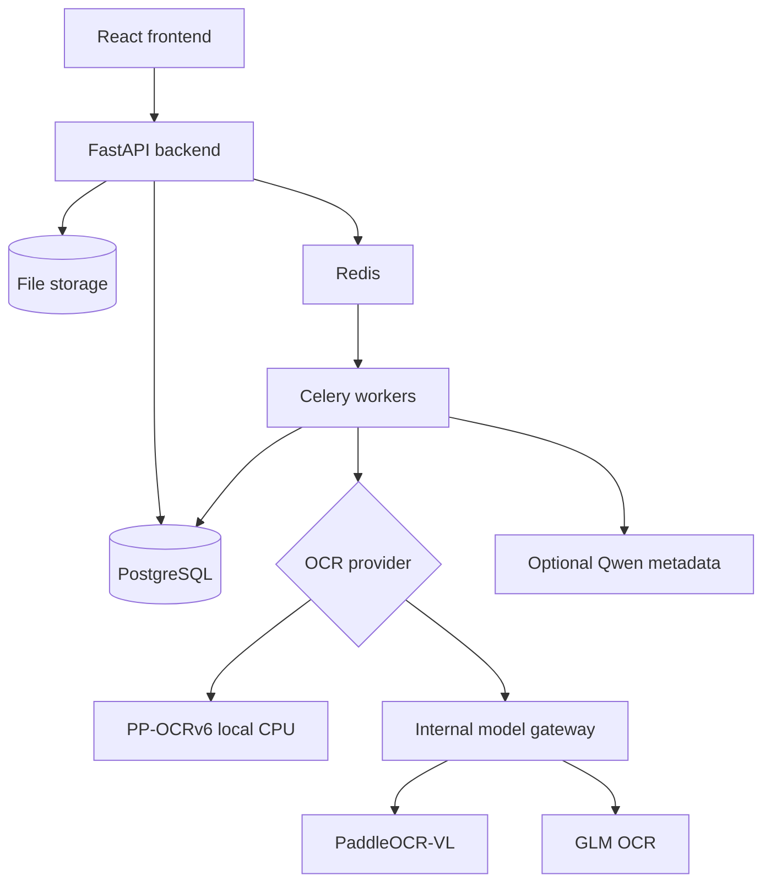

<div align="center">

# Dok OCR

### A private OCR cockpit for turning documents into searchable, reviewable records.

Upload files, run OCR, extract metadata, generate titles, route exceptions, and keep every document traceable from intake to search.


<br/>


</div>

---

## What Dok OCR is

Dok OCR is a self-hosted document processing app, not just an OCR script. It gives you a full workflow around scanned documents, screenshots, PDFs, receipts, invoices, and mixed document batches.

It is built around a simple model:

```txt
Collection → Record → Document
```

Each document can keep its original file, preview, OCR text, extracted metadata, title, review state, processing events, retry history, and search index state.

> [!NOTE]
> Dok OCR can use PaddleOCR-VL and PP-OCRv6, but it is not the PaddleOCR toolkit itself. It is the private document workflow layer around OCR providers, metadata extraction, review, and search.

---

## 🚀 Key Features

### 📄 Smart document OCR

> Turn messy PDFs, scans, screenshots, and receipts into Markdown-friendly OCR text.

- **PaddleOCR-VL path:** smart multimodal parsing through the internal model gateway or any OpenAI-compatible llama.cpp/LM Studio endpoint.
- **PP-OCRv6 local path:** CPU-friendly local OCR for basic deployments without a GPU.
- **Recovery path:** if smart OCR returns empty text, Dok OCR can fall back to PP-OCRv6 instead of silently failing.

### 🧠 Metadata and title workflow

> OCR is only the first step. Dok OCR keeps the document workflow moving.

- **Deterministic extraction:** titles, dates, correspondents, document types, tags, and collection fields.
- **Optional Qwen refinement:** local text reasoning for metadata cleanup when enabled.
- **Field locking:** manual corrections can be preserved during reprocessing.

### 🧾 Review cockpit

> Every document has a visible state, history, and retry path.

- **Failure queues:** failed, duplicate, incomplete, and review-needed documents stay visible.
- **Per-document events:** validation, storage, OCR, metadata, indexing, and retry events are traceable.
- **Manual controls:** rerun OCR, force OCR, re-extract metadata, preview extraction, or rebuild search.

### 🔎 Searchable private archive

> Keep documents searchable without giving up control of where they live.

- **PostgreSQL full-text search:** OCR text, titles, metadata, records, and collections.
- **Collection model:** per-collection OCR defaults, schema rules, title rules, and search defaults.
- **German/English UI:** app shell and core workflows are localized for English and German users.

---

## 🧭 Pipeline

<p align="center">
  
</p>

**Upload → OCR → Metadata → Review → Search**

The pipeline can run automatically after upload. Manual controls remain available for retrying OCR, forcing OCR, re-extracting metadata, locking fields, and rebuilding search.

---

## ⚙️ Choose your runtime

| Mode | Best for | Default provider | Notes |
| --- | --- | --- | --- |
| **Fake** | UI development and smoke tests | `fake` | No real OCR. Fastest way to test the app shell. |
| **Local** | Small machines, CPU-only OCR | `ppocrv6` | No GPU required. PP-OCRv6 models are prewarmed during backend build. |
| **Smart** | Higher quality document parsing | `paddle_vl` | Uses the internal gateway or a direct OpenAI-compatible model endpoint. |
| **Fallback** | Legacy multimodal OCR | `glm` | Kept as a secondary OCR path. |

> [!TIP]
> On sub-4GB machines, run the web app and workers with `fake` or `ppocrv6`, keep worker concurrency low, and put smart multimodal models on a different host or endpoint.

---

## ⚡ Quick start: basic local app

```bash
cd app
cp .env.example .env
# edit .env: change ADMIN_PASSWORD and SECRET_KEY
docker compose up --build
```

Open:

- UI: <http://localhost:3001>
- API docs: <http://localhost:8001/docs>

Prerequisites: Docker Compose and outbound network access for container images, Python packages, and PP-OCRv6 model downloads.

> [!IMPORTANT]
> Dok OCR handles sensitive documents. Run it only on trusted infrastructure, change default credentials, configure HTTPS at your reverse proxy, and back up PostgreSQL plus the file volume.

---

## 🚀 One-click smart PaddleOCR-VL stack

For a full smart OCR setup on a host that already has Docker and a llama.cpp `llama-server` binary, run:

```bash
sudo scripts/install-smart-paddlevl.sh
```

The installer is idempotent. It installs a managed smart-stack directory, packages the internal model gateway, installs the PaddleOCR-VL chat template with OpenAI `image_url` support, writes the llama.cpp model preset, starts or reuses the model manager when possible, and prints the Admin values to save.

If the PaddleOCR-VL GGUF files are not already present under `/root/llm-models`, provide download URLs or place the files manually:

```bash
sudo DOKOCR_PADDLE_MODEL_URL=https://example/paddleocr-vl-q8_0.gguf \
     DOKOCR_PADDLE_MMPROJ_URL=https://example/paddleocr-vl-mmproj.gguf \
     scripts/install-smart-paddlevl.sh
```

Safe preview mode:

```bash
scripts/install-smart-paddlevl.sh --dry-run --skip-download --no-start
```

After the installer finishes:

1. Open **Admin → Model Setup**.
2. Click **Use internal gateway**.
3. Click **Test PaddleOCR-VL**.
4. Save.

---

## 🛠️ Admin setup wizard

The Admin page includes **Model Setup**, a visual runtime wizard for normal users:

- choose `Fake`, `Local`, or `Smart` mode.
- configure PaddleOCR-VL, GLM, and Qwen endpoints.
- use the internal gateway preset.
- test endpoints before saving.
- change global defaults without editing `.env`.

There is also a separate **Model Configuration** area for collection-level OCR defaults such as language, OCR mode, page limits, DPI, output format, and image size limits.

---

## 🔌 OCR and model endpoints

For UI/dev without real OCR:

```env
OCR_PROVIDER=fake
```

For basic local OCR:

```env
OCR_PROVIDER=ppocrv6
```

For smart OCR or Qwen metadata refinement, prefer **Admin → Model Setup**. Advanced users can still configure compatible endpoints directly:

```env
OCR_PROVIDER=paddle_vl
PADDLE_VL_LLAMACPP_BASE_URL=http://host.docker.internal:1234/v1
PADDLE_VL_MODEL_PATH=paddleocr-vl

LLM_METADATA_REFINEMENT_ENABLED=true
QWEN_LLAMACPP_BASE_URL=http://host.docker.internal:1234/v1
QWEN_MODEL_PATH=qwen
```

LM Studio, llama.cpp server, or another OpenAI-compatible service can provide these endpoints. The internal gateway hides routing details, normalizes OCR output, applies deterministic decode settings, and keeps model service details out of the normal user flow.

---

## 🏗️ Architecture



Repository stack:

- React/Vite frontend
- FastAPI backend
- Celery worker, beat, and maintenance workers
- Redis
- PostgreSQL
- local file storage
- OCR provider adapters
- deterministic metadata and title extraction
- optional smart model gateway assets

---

## ✅ What is production-ready and what is not

Ready today:

- private Docker deployment.
- local PP-OCRv6 OCR.
- smart PaddleOCR-VL endpoint integration.
- one-click smart gateway installer for prepared hosts.
- upload, retry, review, metadata, collections, records, and search workflows.

Still environment-dependent:

- smart model weights and reliable download URLs.
- llama.cpp build/install path.
- GPU/CPU performance of external model endpoints.
- HTTPS/reverse proxy and backup policy.

---

## 📚 More documentation

The structural app guide lives in [`app/README.md`](app/README.md), covering runtime architecture, model/OCR modes, setup, document lifecycle, metadata/review behavior, operations, tests, and troubleshooting.

