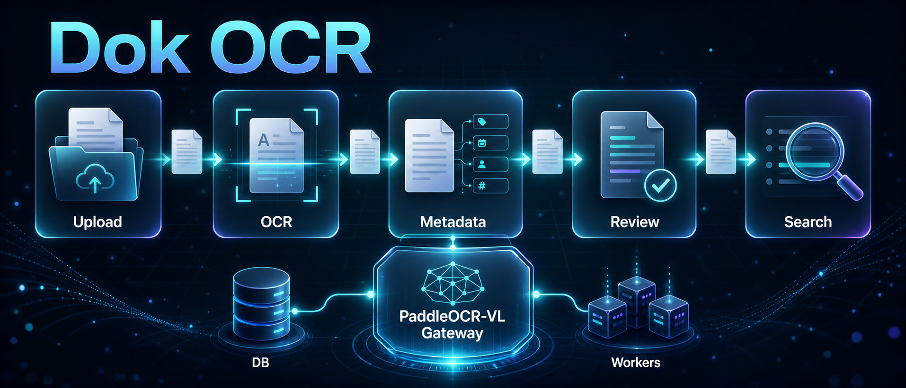
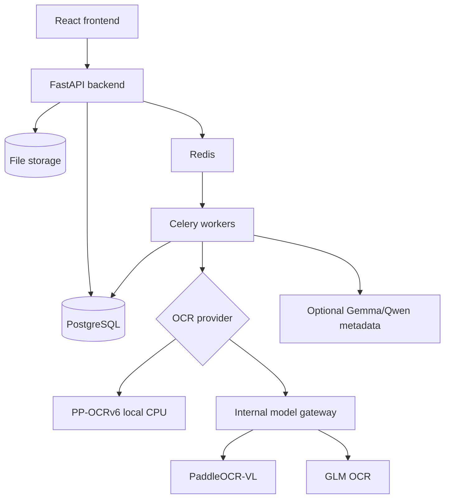

<div align="center">

# Dok OCR

### A private OCR cockpit for turning documents into searchable, reviewable records.

Upload files, run OCR, extract metadata, generate titles, route exceptions, and keep every document traceable from intake to search.


<br/>



</div>

---

## What Dok OCR is

Dok OCR is a self-hosted document processing app, not just an OCR script. It gives you a full workflow around scanned documents, screenshots, PDFs, receipts, invoices, and mixed document batches.

It is built around a simple model:

```txt
Collection → Record → Document
```

Each document can keep its original file, preview, OCR text, extracted metadata, title, review state, processing events, retry history, and search index state.

> [!NOTE]
> Dok OCR can use PaddleOCR-VL and PP-OCRv6, but it is not the PaddleOCR toolkit itself. It is the private document workflow layer around OCR providers, metadata extraction, review, and search.

---

## 🚀 Key Features

### 📄 Smart document OCR

> Turn messy PDFs, scans, screenshots, and receipts into Markdown-friendly OCR text.

- **PaddleOCR-VL path:** strict smart multimodal OCR through any real PaddleOCR-VL-compatible endpoint: OpenVINO CPU, GPU/native, remote, or another compatible service.
- **OpenVINO CPU batch path:** optional tested CPU PaddleOCR-VL gateway with `/v1/ocr/batch` for up to four rendered PDF pages per request using one loaded model.
- **PP-OCRv6 local path:** CPU-friendly local OCR for basic deployments without a GPU.
- **Provider honesty:** when a collection/document selects `paddle_vl`, Dok OCR uses PaddleOCR-VL OCR and surfaces failures instead of silently substituting another OCR engine.

### 🧠 Metadata and title workflow

> OCR is only the first step. Dok OCR keeps the document workflow moving.

- **Deterministic extraction:** titles, dates, correspondents, document types, tags, and collection fields.
- **Optional metadata refinement:** configurable OpenAI-compatible text reasoning for metadata cleanup when enabled. The deployed low-RAM default is Gemma 4 E2B QAT Q4_0, while legacy `qwen` aliases remain for app compatibility.
- **Field locking:** manual corrections can be preserved during reprocessing.

### 🧾 Review cockpit

> Every document has a visible state, history, and retry path.

- **Failure queues:** failed, duplicate, incomplete, and review-needed documents stay visible.
- **Per-document events:** validation, storage, OCR, metadata, indexing, and retry events are traceable.
- **Manual controls:** rerun OCR, force OCR, re-extract metadata, preview extraction, or rebuild search.

### 🔎 Searchable private archive

> Keep documents searchable without giving up control of where they live.

- **PostgreSQL full-text search:** OCR text, titles, metadata, records, and collections.
- **Collection model:** per-collection OCR defaults, schema rules, title rules, and search defaults.
- **German/English UI:** app shell and core workflows are localized for English and German users.

---

## 🧭 Pipeline

<p align="center">
  
</p>

**Upload → OCR → Metadata → Review → Search**

The pipeline can run automatically after upload. Manual controls remain available for retrying OCR, forcing OCR, re-extracting metadata, locking fields, and rebuilding search.

---

## ⚙️ Choose your runtime

| Mode | Best for | Default provider | Notes |
| --- | --- | --- | --- |
| **Fake** | UI development and smoke tests | `fake` | No real OCR. Fastest way to test the app shell. |
| **Local** | Small machines, CPU-only OCR | `ppocrv6` | No GPU required. PP-OCRv6 models are prewarmed during backend build. |
| **Smart** | Higher quality document parsing | `paddle_vl` | Uses any real PaddleOCR-VL-compatible endpoint. OpenVINO is the tested CPU option; GPU/native/remote endpoints are valid. ik_llama/Gemma metadata does not replace PaddleOCR-VL OCR. |
| **Fallback** | Legacy multimodal OCR | `glm` | Kept as a secondary OCR path. |

> [!TIP]
> On sub-4GB machines, run the web app and workers with `fake` or `ppocrv6`, keep worker concurrency low, and put smart multimodal models on a different host or endpoint.

---

## ⚡ Quick start: basic local app

```bash
cd app
cp .env.example .env
# edit .env: change ADMIN_PASSWORD and SECRET_KEY
docker compose up --build
```

Open:

- UI: <http://localhost:3001>
- API docs: <http://localhost:8001/docs>

Prerequisites: Docker Compose and outbound network access for container images, Python packages, and PP-OCRv6 model downloads.

> [!IMPORTANT]
> Dok OCR handles sensitive documents. Run it only on trusted infrastructure, change default credentials, configure HTTPS at your reverse proxy, and back up PostgreSQL plus the file volume.

---

## 🚀 Optional PaddleOCR-VL endpoint installers

These installers provision a local PaddleOCR-VL OCR endpoint. Skip them if you already have a GPU/native/remote PaddleOCR-VL endpoint; paste that endpoint in **Admin → Model Setup** instead. OpenVINO is the tested CPU option. The legacy llama.cpp/GGUF backend remains for old prepared hosts only and is not required for the Gemma metadata sidecar.

### Optional tested CPU backend: OpenVINO 2025.2

For CPU-only hosts that need a local PaddleOCR-VL endpoint, install the OpenVINO gateway:

```bash
sudo scripts/install-smart-paddlevl.sh --backend openvino-cpu
```

This installs a host-level `dokocr-paddlevl-openvino` service, pins OpenVINO `2025.2.0`, downloads the preconverted PaddleOCR-VL OpenVINO model, and serves:

```text
GET  /health
GET  /v1/models
POST /v1/chat/completions
POST /v1/ocr/batch       # up to 4 page images, one loaded model
```

The installer prints the **Admin → Model Setup** values to save. Use the Docker network gateway URL it prints, for example `http://172.x.0.1:8091/v1`, when Dok OCR runs in Compose.

OpenVINO `2025.2.0` is pinned intentionally. Newer `2025.3+` / `2026.x` CPU wheels have known SIGFPE regressions on some AMD Zen 4 / KVM hosts.

### Legacy optional GGUF OCR backend: llama.cpp smart proxy

This path is for legacy PaddleOCR-VL GGUF OCR deployments only. Do **not** install normal llama.cpp just for metadata refinement; production metadata uses the separate `deploy/qwen-ik-router/` ik_llama.cpp sidecar. If you already have GPU/native/remote PaddleOCR-VL, skip this installer and configure that endpoint directly.

For a host that already has Docker and a compatible llama.cpp `llama-server` binary, run:

```bash
sudo scripts/install-smart-paddlevl.sh --backend llamacpp
```

If the PaddleOCR-VL GGUF files are not already present under `/root/llm-models`, provide download URLs or place the files manually:

```bash
sudo DOKOCR_PADDLE_MODEL_URL=https://example/paddleocr-vl-q8_0.gguf \
     DOKOCR_PADDLE_MMPROJ_URL=https://example/paddleocr-vl-mmproj.gguf \
     scripts/install-smart-paddlevl.sh --backend llamacpp
```

Safe preview mode:

```bash
scripts/install-smart-paddlevl.sh --backend openvino-cpu --dry-run --skip-download --no-start
```

After either installer path finishes:

1. Open **Admin → Model Setup**.
2. Select `paddle_vl` as the default OCR provider.
3. Paste or confirm the PaddleOCR-VL endpoint.
4. Click **Test PaddleOCR-VL**.
5. Adjust **OCR time budget** if processing large books/docs.
6. Save.

### Metadata sidecar standard

Production metadata refinement uses an OpenAI-compatible text endpoint after OCR. Runtime choices are intentionally configurable:

- **CPU / low-RAM metadata:** use the `deploy/qwen-ik-router/` ik_llama.cpp sidecar with Google Gemma 4 E2B QAT Q4_0. This is the deployed tested default and keeps legacy Qwen model names for compatibility.
- **Strong GPU metadata:** point metadata refinement at a larger local OpenAI-compatible text model.
- **Remote metadata:** point metadata refinement at any compatible remote text endpoint.

The ik_llama.cpp sidecar is text-only metadata extraction after OCR; it does not run PaddleOCR-VL and does not replace your PaddleOCR-VL endpoint, whether that endpoint is OpenVINO CPU, GPU/native, or remote.

Tested CPU / low-RAM ik_llama.cpp sidecar defaults:

```text
model: /root/llm-models/gemma-4-E2B-it-qat-q4_0-gguf/gemma-4-E2B_q4_0-it.gguf
download: https://huggingface.co/google/gemma-4-E2B-it-qat-q4_0-gguf/resolve/main/gemma-4-E2B_q4_0-it.gguf?download=true
model id: gemma-4-e2b-it-qat-q4_0
aliases: gemma-e2b,qwen-mtp,qwen3.5-2b,qwen
spec: ngram-mod:n_max=16,n_min=0,ngram_size_n=40
batch/ubatch: 1024/512
```

Gemma 4 requires `--jinja` and `--override-kv tokenizer.ggml.add_bos_token=bool:false`. Keep `--run-time-repack` disabled on small CPU hosts.

---

## 🛠️ Admin setup wizard

The Admin page includes **Model Setup**, a visual runtime wizard for normal users:

- choose `Fake`, `Local`, or `Smart` mode.
- configure PaddleOCR-VL OCR, GLM fallback OCR, and optional Gemma/Qwen metadata endpoints.
- use the internal gateway preset.
- test endpoints before saving.
- change global defaults without editing `.env`.
- tune OCR time budgets for large CPU-only books/documents, including PaddleOCR-VL per-4-page chunk limits.

There is also a separate **Model Configuration** area for collection-level OCR defaults such as language, OCR mode, page limits, DPI, output format, and image size limits.

---

## 🔌 OCR and model endpoints

For UI/dev without real OCR:

```env
OCR_PROVIDER=fake
```

For basic local OCR:

```env
OCR_PROVIDER=ppocrv6
```

For smart OCR or metadata refinement, prefer **Admin → Model Setup**. Advanced users can still configure compatible endpoints directly:

```env
OCR_PROVIDER=paddle_vl
PADDLE_VL_LLAMACPP_BASE_URL=http://host.docker.internal:8091/v1
PADDLE_VL_MODEL_PATH=paddleocr-vl

LLM_METADATA_REFINEMENT_ENABLED=true
QWEN_LLAMACPP_BASE_URL=http://host.docker.internal:18082/v1
QWEN_MODEL_PATH=qwen
```

The deployed CPU metadata sidecar serves Gemma 4 E2B QAT Q4_0 through ik_llama.cpp behind the legacy `qwen` aliases, but metadata models are configurable. Strong-GPU installs can use a larger local/remote OpenAI-compatible text model by setting the metadata base URL/model in **Admin → Model Setup** or via `QWEN_LLAMACPP_BASE_URL` and `QWEN_MODEL_PATH`. This is separate from OCR: PaddleOCR-VL still needs a real PaddleOCR-VL endpoint, such as OpenVINO CPU, GPU/native, or remote. The OpenVINO gateway also exposes `/v1/ocr/batch`, which Dok OCR uses to process rendered PaddleOCR-VL PDF pages in chunks of up to four without loading multiple model copies. The internal gateway hides routing details, normalizes OCR output, applies deterministic decode settings, and keeps model service details out of the normal user flow.

---

## 🏗️ Architecture



Repository stack:

- React/Vite frontend
- FastAPI backend
- Celery worker, beat, and maintenance workers
- Redis
- PostgreSQL
- local file storage
- OCR provider adapters
- deterministic metadata and title extraction
- optional smart model gateway assets

---

## ✅ What is production-ready and what is not

Ready today:

- private Docker deployment.
- local PP-OCRv6 OCR.
- smart PaddleOCR-VL endpoint integration.
- one-click smart gateway installer for prepared hosts.
- upload, retry, review, metadata, collections, records, and search workflows.

Still environment-dependent:

- smart model weights and reliable download URLs.
- external PaddleOCR-VL endpoint setup: OpenVINO CPU, GPU/native/remote, or legacy GGUF.
- optional metadata model choice: tested CPU ik_llama.cpp + Gemma E2B QAT Q4 sidecar, larger GPU-hosted text models, or remote OpenAI-compatible models.
- GPU/CPU performance of external model endpoints.
- HTTPS/reverse proxy and backup policy.

---

## 📚 More documentation

The structural app guide lives in [`app/README.md`](app/README.md), covering runtime architecture, model/OCR modes, setup, document lifecycle, metadata/review behavior, operations, tests, and troubleshooting.

