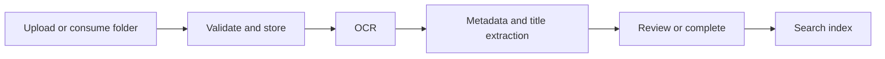

# Dok OCR

Automated self-hosted document OCR workflow for uploads, metadata extraction, review, and search.


Dok OCR automatically turns PDFs and scanned documents into searchable records. It runs OCR, extracts metadata, generates titles, routes exceptions for review, and keeps documents organized as collections, records, and files.

> [!IMPORTANT]
> Dok OCR handles sensitive documents. Run it only on trusted infrastructure, change default credentials, configure HTTPS at your reverse proxy, and back up PostgreSQL plus the file volume.

## What it does

| Workflow | Details |
| --- | --- |
| Automatic pipeline | Upload once, then OCR, metadata extraction, title generation, search indexing, and review routing run in sequence. |
| OCR engines | Choose `paddle_vl` for smart document parsing, `ppocrv6` for fast/simple OCR, `glm` as fallback, or `fake` for tests. |
| Metadata extraction | Deterministic invoice/receipt extraction with optional Qwen metadata refinement and neutral-file handling. |
| Document model | Browse documents as `Collection → Record → Document`, with per-document OCR text, metadata, events, and retries. |
| Review and search | Find OCR text through PostgreSQL full-text search, then retry, re-extract, lock, or send documents to review. |
| Admin console | Configure collection OCR defaults, ingestion sources, hooks, integrations, maintenance actions, and EN/DE UI. |

## How it works



Stack: React/Vite frontend, FastAPI backend, Celery workers, Redis, PostgreSQL, local file storage, and optional external model endpoints.

The default app stack can run without a model server in fake/test mode. Real OCR can use local PP-OCRv6, or external OpenAI-compatible model endpoints for smart OCR and Qwen metadata refinement.

## Run it

```bash
cd app
cp .env.example .env
# edit .env: change ADMIN_PASSWORD and SECRET_KEY
docker compose up --build
```

Open:

- UI: <http://localhost:3001>
- API docs: <http://localhost:8001/docs>

Default development login is defined in `app/.env.example`. Change it before real use.

### OCR setup

For a basic local start, use `OCR_PROVIDER=fake` for UI/dev or `OCR_PROVIDER=ppocrv6` for fast local OCR.

Smart multimodal OCR currently requires external model endpoints configured through environment variables, for example:

```env
OCR_PROVIDER=paddle_vl
PADDLE_VL_LLAMACPP_BASE_URL=http://host.docker.internal:1234/v1
PADDLE_VL_MODEL_PATH=paddleocr-vl

LLM_METADATA_REFINEMENT_ENABLED=true
QWEN_LLAMACPP_BASE_URL=http://host.docker.internal:1234/v1
QWEN_MODEL_PATH=qwen
```

LM Studio, llama.cpp server, or a small model proxy can provide these OpenAI-compatible endpoints. The live deployment uses an out-of-repo Flask smart-proxy in front of llama.cpp; that proxy is deployment-specific and not included in the default app stack.

## Current status

- Active self-hosted project, tested on a private server workflow.
- German and English UI are implemented; OCR/document-language behavior is configured separately.
- Collection/document OCR defaults are configurable in Admin.
- Global visual setup for LM Studio/llama.cpp endpoints is planned; today those endpoints are configured in `.env`.
- Detailed setup, operations, upload limits, converters, migrations, tests, and API notes live in [`app/README.md`](app/README.md).

## Roadmap

- Bootstrap scripts for easy `fake`, `ppocrv6`, and smart endpoint setup.
- Admin model setup wizard for LM Studio, llama.cpp, and OpenAI-compatible endpoints.
- Public demo screenshots with non-sensitive sample documents.
- More German OCR hints and extraction synonyms.
- CSS/docs cleanup as the UI stabilizes.
