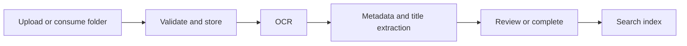

# Dok OCR

Automated self-hosted document OCR workflow for uploads, metadata extraction, review, and search.


Dok OCR automatically turns PDFs and scanned documents into searchable records. It runs OCR, extracts metadata, generates titles, routes exceptions for review, and keeps documents organized as collections, records, and files.

It is built around a `Collection → Record → Document` model. A document can store the original file, preview/thumbnail data, OCR text, extracted metadata, review state, events, and retry/reprocessing settings.

## Why it is useful

- Runs as a normal Docker app without a GPU; use `ppocrv6` for local CPU OCR or `fake` for UI/dev.
- Keeps large smart models outside the main containers, so small machines can run the web app and workers while LM Studio, llama.cpp, or another endpoint runs elsewhere.
- On sub-4GB machines, use `fake`/`ppocrv6`, keep OCR worker concurrency low, and put smart multimodal models on another endpoint.
- Automates the pipeline from upload to OCR, metadata extraction, title generation, search indexing, and review routing.
- Keeps manual controls for retrying OCR, re-extracting metadata, locking fields, and reviewing exceptions.

> [!IMPORTANT]
> Dok OCR handles sensitive documents. Run it only on trusted infrastructure, change default credentials, configure HTTPS at your reverse proxy, and back up PostgreSQL plus the file volume.

## Scope

The repository contains the app stack:

- React/Vite frontend
- FastAPI backend
- Celery workers and beat
- Redis
- PostgreSQL
- local file storage
- OCR provider adapters and deterministic metadata extraction

Supported OCR providers in the app configuration:

- `fake`: test/development OCR
- `ppocrv6`: local PP-OCRv6 OCR path
- `paddle_vl`: external PaddleOCR-VL-style multimodal endpoint
- `glm`: external GLM OCR fallback endpoint

Optional Qwen metadata refinement is configured separately from OCR.

## Pipeline



The pipeline can run automatically after upload. Review and retry controls remain available when extraction is incomplete or needs correction.

## Run locally

```bash
cd app
cp .env.example .env
# edit .env: change ADMIN_PASSWORD and SECRET_KEY
docker compose up --build
```

Prerequisites: Docker Compose and outbound network access for image, Python package, and PP-OCRv6 model downloads. The first backend build prewarms PP-OCRv6 even when you start with `OCR_PROVIDER=fake`.

Open:

- UI: <http://localhost:3001>
- API docs: <http://localhost:8001/docs>

Default development login is defined in `app/.env.example`. Change it before real use.


## One-click smart PaddleOCR-VL stack

For a full smart OCR setup on a host that already has Docker and a llama.cpp `llama-server` binary, run:

```bash
sudo scripts/install-smart-paddlevl.sh
```

The installer is idempotent. It writes a managed smart-stack directory, installs the smart-proxy container, installs the PaddleOCR-VL chat template with OpenAI `image_url` support, writes the llama.cpp model preset, starts/reuses the model manager when possible, and prints the Admin values to save.

If the PaddleOCR-VL GGUF files are not already present under `/root/llm-models`, provide download URLs or place the files manually:

```bash
sudo DOKOCR_PADDLE_MODEL_URL=https://example/paddleocr-vl-q8_0.gguf \
     DOKOCR_PADDLE_MMPROJ_URL=https://example/paddleocr-vl-mmproj.gguf \
     scripts/install-smart-paddlevl.sh
```

After it finishes, open **Admin → Model Setup**, click **Use internal gateway**, test **PaddleOCR-VL**, and save.

Safe preview mode:

```bash
scripts/install-smart-paddlevl.sh --dry-run --skip-download --no-start
```

## OCR and model endpoints

For UI/dev without a real OCR model:

```env
OCR_PROVIDER=fake
```

For basic local OCR:

```env
OCR_PROVIDER=ppocrv6
```

For smart OCR or Qwen metadata refinement, configure Admin → Model Setup. Most local deployments should use the internal model gateway; advanced users can point directly at OpenAI-compatible endpoints in Admin or `.env`, for example:

```env
OCR_PROVIDER=paddle_vl
PADDLE_VL_LLAMACPP_BASE_URL=http://host.docker.internal:1234/v1
PADDLE_VL_MODEL_PATH=paddleocr-vl

LLM_METADATA_REFINEMENT_ENABLED=true
QWEN_LLAMACPP_BASE_URL=http://host.docker.internal:1234/v1
QWEN_MODEL_PATH=qwen
```

LM Studio, llama.cpp server, or another compatible service can provide these endpoints. The app can also use an internal model gateway to hide routing, OCR/metadata cleanup, and local endpoint details; the technical service name may appear only in diagnostics.

## Admin configuration

The Admin UI can configure collection-level OCR defaults, ingestion sources, processing hooks, integration status, and maintenance actions.

Global model endpoints can be configured in Admin → Model Setup. Use it to choose fake/local/smart mode, enter LM Studio or llama.cpp-compatible URLs, test endpoints, and save defaults without editing `.env`.

## More documentation

Detailed setup and operations notes are in [`app/README.md`](app/README.md), including upload limits, optional converters, reverse proxy settings, migrations, tests, API routes, and the document model.
